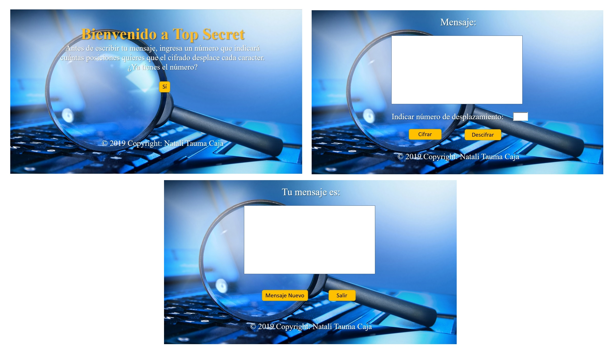
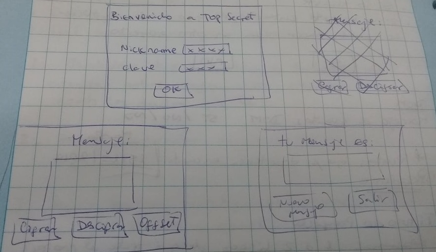
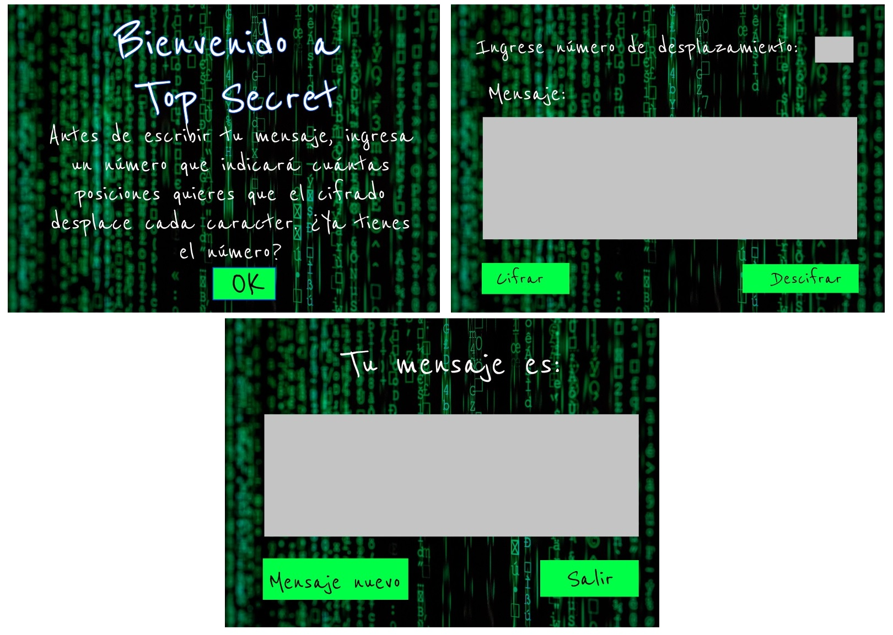

# TOP SECRET

## Índice

* [1. Resumen del proyecto](#1-resumen-del-proyecto)
* [2. Imagen Final del Proyecto](#2-imagen-final-del-proyecto)
* [3. Investigación UX](#3-investigación-ux)
* [4. Enlace Deploy](#4-enlace-deploy)

***

## 1. Resumen del proyecto

Top Secret es una página para cifrar y descifrar mensajes secretos, la clave para el cifrado solo lo sabrá los involucrados.

## 2. Imagen Final del Proyecto

## 3. Investigación UX
 
 * TOP SECRET está dirigido a usuarios que se dedican a la investigación privada: Detectives y la Fuerza Armada de Inteligencia. El objetivo del sistema es codificar y mantener en secreto los mensajes enviados entre los involucrados.
 
* Debido a que los detectives y la Fuerza armada necesitan enviar mensajes de suma importancia, este sistema se encargará de codificar y decodificar los textos, solo tendrán que tener en cuenta en número de desplazamiento para ambos casos, ya que servirá para saber el contenido del mensaje por ambas partes.

* Primer prototipo en papel

* Agregar un resumen del feedback recibido indicando las mejoras a realizar.
En el primer feedback me recomendaron que cambiara la primera parte: Nickname y Clave, ya que no tenía un funcionamiento específico. Asimismo, en la segunda vista me sugirieron en vez de la palabra OFFSET se cambie por una palabra o frase que el usuario pueda entender.
Luego realicé una primera maqueta en FIGMA, y el después del segundo feedback me recomendaron que cambar la posición del box de desplazamiento y el tema de los colores oscuros por uno más llamativo.

* Imagen de la maqueta FIGMA.

* Imagen del prototipo final.

## 4. Enlace Deploy

https://natalitc.github.io/LIM011-cipher/

## Objetivos de aprendizaje Cipher

A continuación te presentamos los objetivos de aprendizaje de este proyecto. Reflexiona y luego marca los objetivos que has llegado a **entender** y **aplicar** en tu proyecto.

### UX

- [x] Diseñar la aplicación pensando y entendiendo al usuario.
- [x] Crear prototipos para obtener feedback e iterar.
- [x] Aplicar los principios de diseño visual (contraste, alineación, jerarquía).

### HTML y CSS

- [x] Uso correcto de HTML semántico.
- [x] Uso de selectores de CSS.
- [ ] Construir tu aplicación respetando el diseño realizado (maquetación).

### DOM

- [x] Uso de selectores del DOM.
- [x] Manejo de eventos del DOM.
- [x] Manipulación dinámica del DOM.

### Javascript

- [x] Manipulación de strings.
- [x] Uso de condicionales (if-else | switch).
- [x] Uso de bucles (for | do-while).	
- [x] Uso de funciones (parámetros | argumentos | valor de retorno).
- [x] Declaración correcta de variables (const & let).

### Testing
- [x] Testeo de tus funciones.

### Git y GitHub
- [x] Comandos de git (add | commit | pull | status | push).
- [x] Manejo de repositorios de GitHub (clone | fork | gh-pages).

### Buenas prácticas de desarrollo
- [ ] Uso de identificadores descriptivos (Nomenclatura | Semántica).
- [x] Uso de linter para seguir buenas prácticas (ESLINT).
